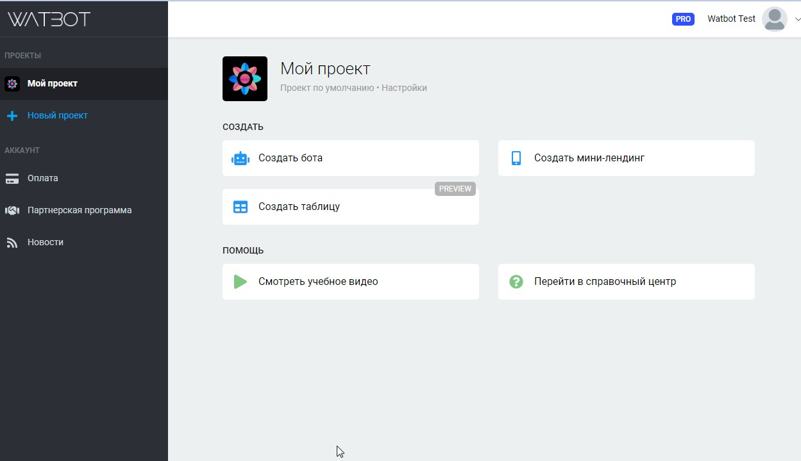
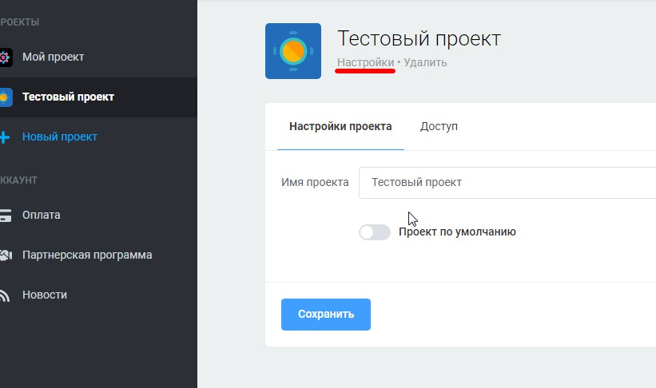

# Настройки проекта

Зайдя в свой аккаунт вы увидите раздел "Мой проект". Также слева находится панель, где вы можете создать другие проекты. В каждом проекты вы можете создать боты. Проекты позволяют группировать боты как папки.

<figure><figcaption></figcaption></figure>

В настройках к проекту вы можете сменить его имя, а также дать права сотрудникам:

<figure><figcaption></figcaption></figure>
