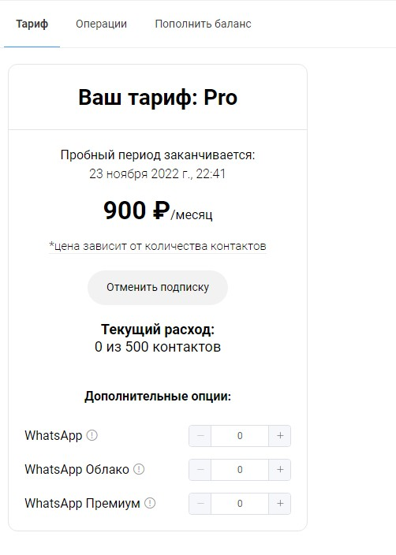
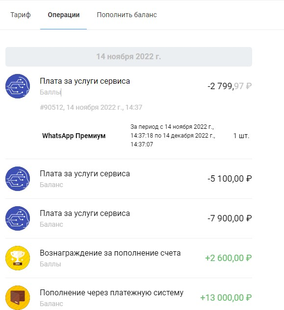
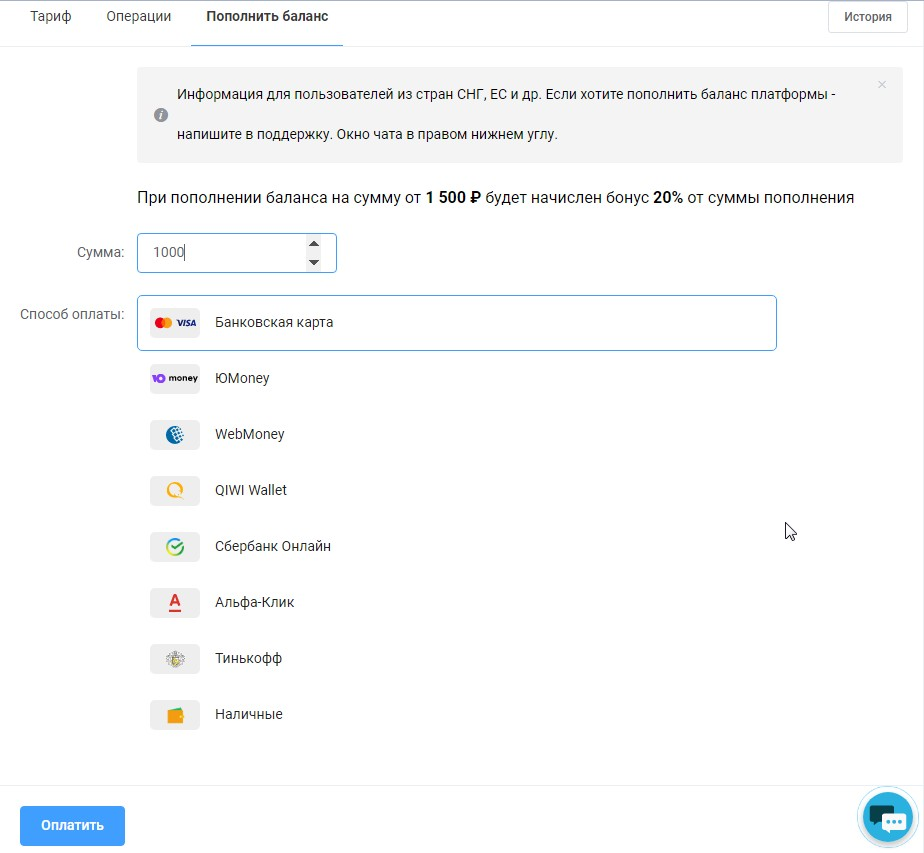

# Оплата

Чтобы оплатить использование платформы зайдите на главную страницу аккаунта и кликните справа на меню "оплата":

<figure><figcaption></figcaption></figure>

Всем новым пользователям предоставляется неделя бесплатного доступа к тарифу Pro. \
На этой странице вы увидите

* ваш тариф,
* до какого числа он оплачен (за два дня до окончания подписки на почту придёт напоминание об оплате),
* общее число контактов (пользователей всеми ботами вашего аккаунта),
* дополнительные опции (если вам требуется Whatsapp, необходимо нажать на + рядом с одним из трёх имеющихся тарифов и указать необходимое число аккаунтов).

<figure><figcaption></figcaption></figure>

В разделе "операции" вы увидите все ваши пополнения и списания. При клике откроется более детальное описание:

<figure><figcaption></figcaption></figure>

Чтобы оплатить подписку перейдите в раздел "пополнить баланс". Вы можете выбрать подходящий вариант оплаты. Для оплаты с зарубежной карты или через ИП свяжитесь с нашей тех.поддержкой. кликнув на иконку сообщений в нижнем правом углу:

<figure><figcaption></figcaption></figure>

При пополнении от 1500руб. вам начисляется бонус в размере 20% от суммы платежа.
