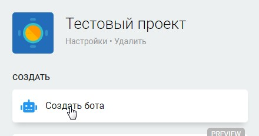
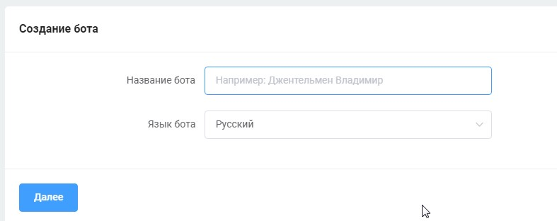
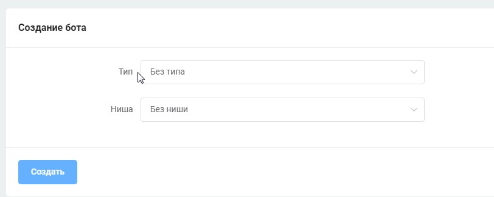
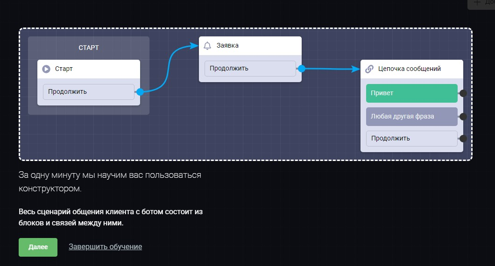

# Создать бота

Для создания бота кликните на одноименную кнопку в проекте:

<figure><figcaption></figcaption></figure>

После потребуется дать ему название, а также выбрать тип и нишу (этот шаг необязательный):

<figure><figcaption></figcaption></figure>

<figure><figcaption></figcaption></figure>

После вам откроется карта сценария, где и происходит сборка бота. В начале вам будет предложено пройти обучение:

<figure><figcaption></figcaption></figure>


