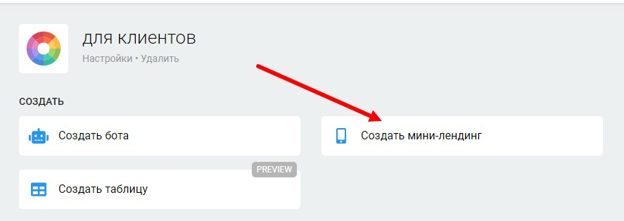
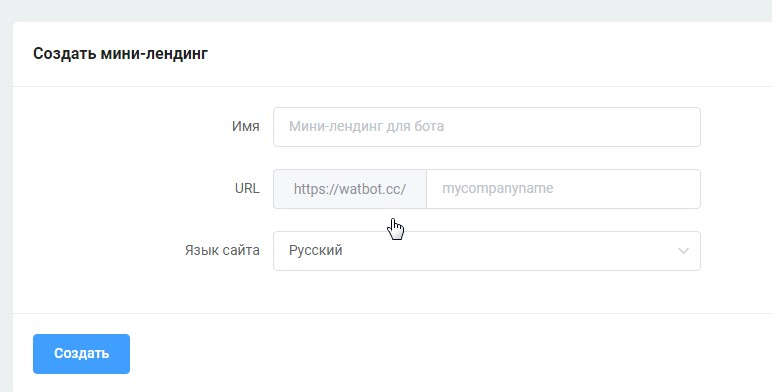

# Создать мини-лендинг

Кнопка создания мини-лендингов находится в проекте, рядом с кнопкой создания бота:

<figure><figcaption></figcaption></figure>

Далее вам потребуется вписать название и латиницей название ссылки:

<figure><figcaption></figcaption></figure>


[ssylki-na-chat-boty-v-knopkakh-mikrolendingov.md](../../mikrolendingi/ssylki-na-chat-boty-v-knopkakh-mikrolendingov.md)



[bloki-stranicy.md](../../mikrolendingi/bloki-stranicy.md)



[obshie-nastroiki-stranicy.md](../../mikrolendingi/obshie-nastroiki-stranicy.md)



[nastroiki-saita.md](../../mikrolendingi/nastroiki-saita.md)


