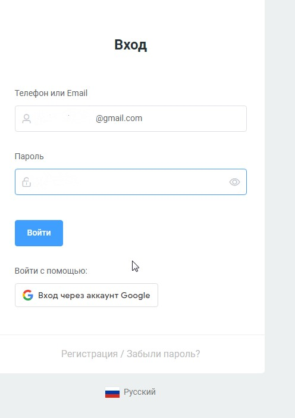

# Вход и регистрация

Пройдя по ссылке [https://watbot.ru/](https://watbot.ru/) вы окажетесь на главной странице платформы. По кнопкам в верхнем правом углу вы можете зайти в свой аккаунт или зарегистрироваться.

<figure><figcaption></figcaption></figure>

При нажатии на кнопку "регистрация" вы попадаете на форму для заполнения. При необходимости можно выбрать язык:

<figure><figcaption></figcaption></figure>

После ввода данных и нажатия на кнопку "регистрация" под форму вам на почту придёт письмо со ссылкой для подтверждения регистрации.  После перехода по ссылке вы можете зайти в свой аккаунт на платформе под своими паролем и логином. Также возможен вход через ваш гугл-аккаунт.

<figure><figcaption></figcaption></figure>

