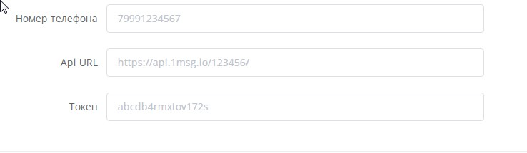
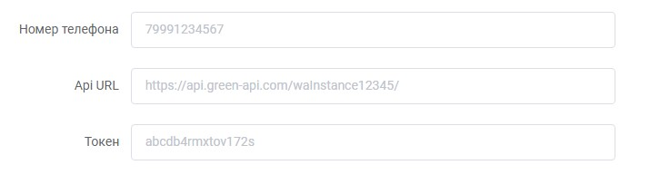
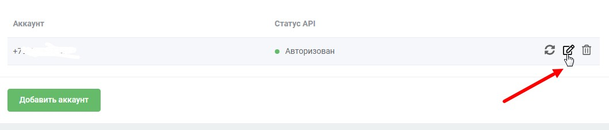
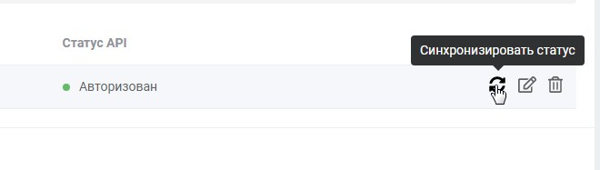
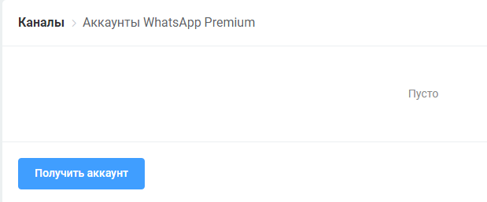

# Подключение и тарифы

&#x20;Первый этап одинаковый для всех:

Слева заходим во вкладку "каналы"

**1) Тариф WhatsApp Cloud.**&#x20;

* От вас ничего не требуется, вы получите готовый облачный аккаунт WhatsApp по одному клику. На одном номере может быть запущено несколько ботов различных тематик разных пользователей платформы, поэтому профиль WhatsApp предоставляется без фото, а в качестве имени будет установлено имя "WhatsApp Консультант", или что-то в этом роде. Нет функции авторассылки.
* Стоимость: 4 900,00 ₽/мес
* **Подключение:** нажимаем кнопку “получить аккаунт”. Видим ссылку на бота. Готово

.png>)


Обратите внимание, что на тарифе **WhatsApp Cloud** нет возможности авторассылок!


**2) WhatsApp**&#x20;

* Зарегистрируйтесь в сервисе [https://1msg.io/](https://1msg.io/) или [GreenApi](https://green-api.com/), и подключите WhatsApp. Затем введите полученные данные в форме ниже.\
  \
  [https://1msg.io/](https://1msg.io/) предоставляет официальный WhatsApp Business API, смартфон для запуска WhatsApp не нужен.\
  \
  Для подключения к [GreenApi](https://green-api.com/) от вас понадобится смартфон для запуска WhatsApp, а также для бесперебойной работы сервиса позаботьтесь о том, чтобы ваше устройство было постоянно в сети.
* Стоимость: 2 900,00 ₽/мес
* На данном тарифе опция авторассылки. Обратите внимание, что в Whatsapp настроена медленная рассылка в соответствии с ограничениями мессенджера. После запуска авторассылки все сообщения становятся в очередь.&#x20;
* Подключение:&#x20;

Обратите внимание на формат ввода api url:

Для [1msg](https://1msg.io/):

<figure><figcaption></figcaption></figure>

И для Green Api

<figure><figcaption></figcaption></figure>


Обратите внимание на заполнение строки Api Url, там должна быть не только ссылка но и "wainstance<токен с платформы greenapi>


Если требуется отредактировать или обновить данные, не удаляйте канал. Воспользуйтесь функцией редактирования:

<figure><figcaption></figcaption></figure>

После обязательно синхронизируйте статус:

<figure><figcaption></figcaption></figure>

**3) WhatsApp Premium**

* От вас потребуется лишь указать имя аккаунта WhatsApp, прислать фото профиля, и выбрать выделенный номер телефона для вашего бота. Устройство для запуска WhatsApp будет запущено на нашей стороне.
* На данном тарифе есть возможность как авторассылок имеющимся пользователям бота, так и загрузка базы номеров для отправки рассылки. Обратите внимание, что в Whatsapp настроена медленная рассылка в соответствии с ограничениями мессенджера. После запуска авторассылки все сообщения становятся в очередь. Ночью рассылка останавливается.
* Стоимость: 7 900,00 ₽/мес
* Подключение:

Нажимаем кнопку “добавить аккаунт”.

&#x20;Мы получаем заявку и добавляем опцию.

Подробная информация по подключение опций Whatsapp:


