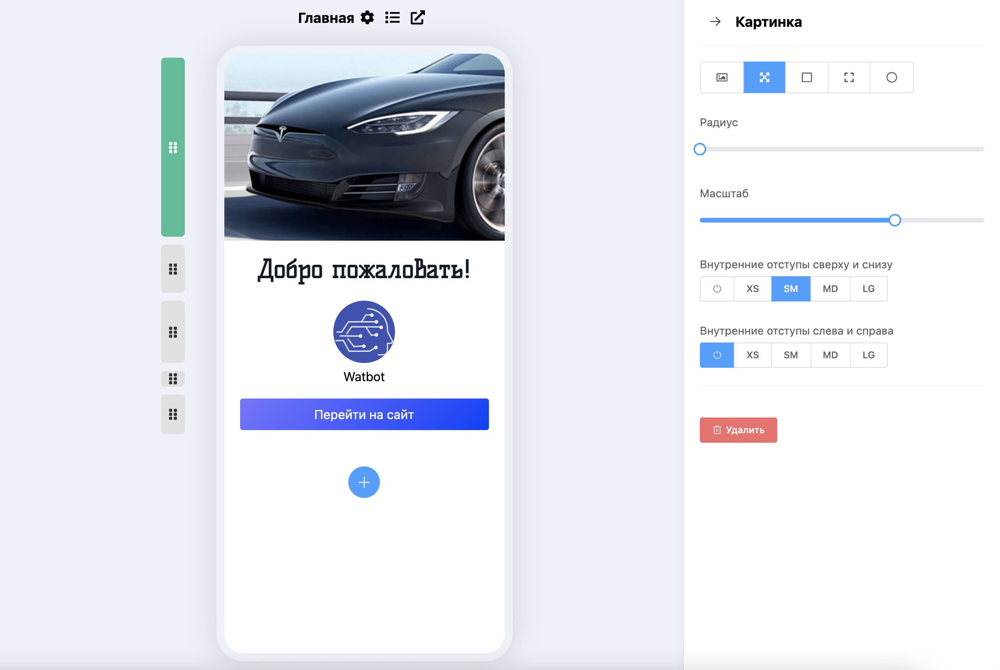

# Блоки страницы

Для одного мини-лендинга можно создать множество страниц, которые состоят из блоков (тип контента на странице). Блоки имеют гибкие настройки и легко меняются местами между собой. На данный момент поддерживаются три типа блоков:

* Картинка
* Текст&#x20;
* Кнопка

#### Картинка

Платформа позволяет загружать картинки, масштабировать их, менять размер, закруглять углы, изменять формат отображения и т. д.

#### Текст

Для форматирования текста добавили основной набор инструментов с помощью которого можно задавать тексту размер, шрифт, цвет, толщину, наклон, подчеркивание, зачеркивание, отступы, ссылки и т.д. На данный момент конструктор мини-лендингов поддерживает 14 шрифтов.

#### Кнопка

.jpg>)

.jpg>)

Кнопки предназначены в первую очередь для открытия ссылок и переходов в бота. Вы можете настраивать кнопкам размер, цвет, градиент, тень, границу, задавать поведение при наведении курсора на кнопку или при нажатии. Кнопки можно ставить на всю ширину, в один ряд или в группу.&#x20;

При создании новой кнопки вы можете легко скопировать стиль другой кнопки, нажав на кнопку «Скопировать стиль», а затем нажав на «Вставить стиль».

