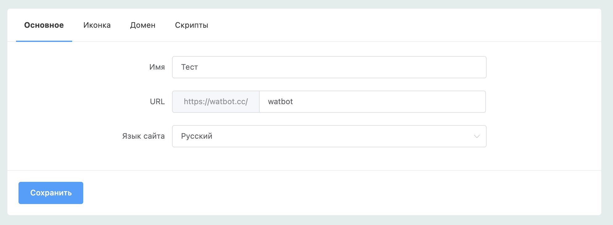
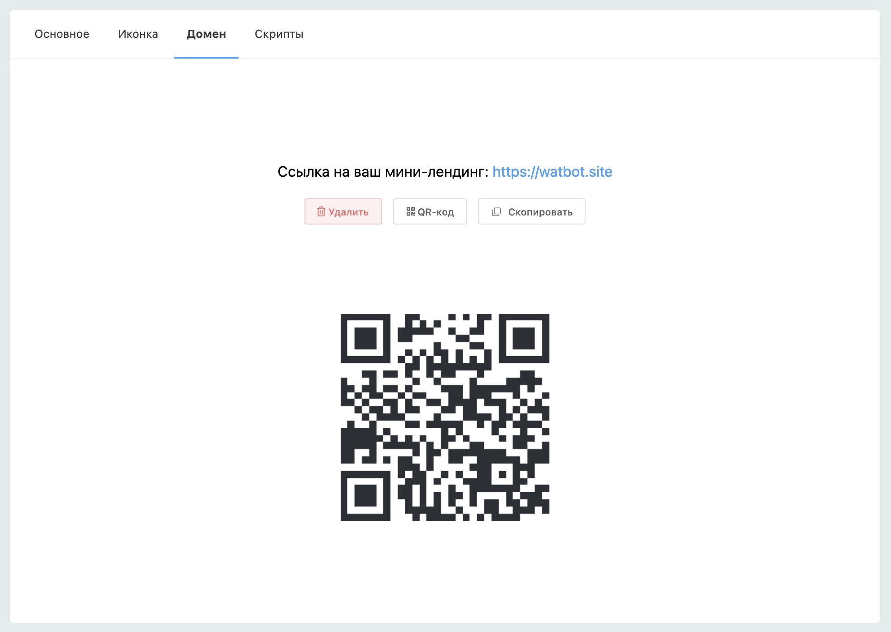
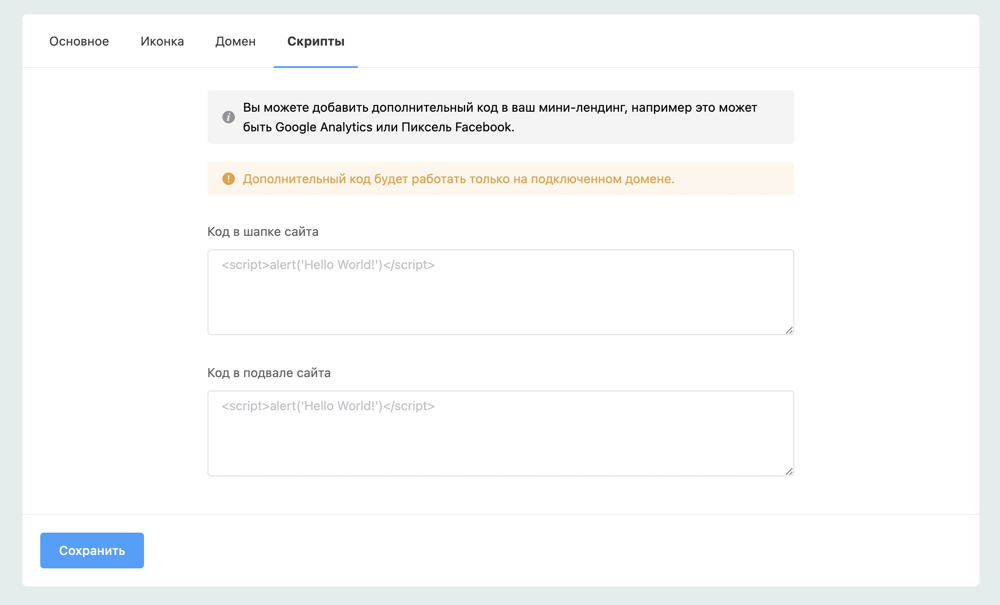

# Настройки сайта

#### Основное

В основных настройках вы можете задать имя сайта, URL или язык. Имя используется для заголовка всех страниц, если не указаны SEO-настройки для конкретной страницы.

#### Иконка

Вы можете загрузить картинку любого размера, иконка легко масштабируется и настраивается под необходимый размер для использования на различных устройствах в качестве favicon или значка на рабочем столе.

#### Собственный домен

Разработали поддержку ваших доменов, которые очень просто прикрепить к нашей платформе, прописав необходимые DNS-записи.&#x20;

Так же для соблюдения современных стандартов безопасности мы разработали автоматический выпуск SSL-сертификата для вашего домена абсолютно бесплатно, вам ничего не нужно для этого делать, просто прикрепите домен и дождитесь окончания процесса.

#### Дополнительные скрипты

Вы можете добавлять дополнительный код в ваши мини-лендинги, например это может быть счетчик Яндекс.Метрики или Пиксель Facebook.


Чтобы на вашем мини-лендинге работала яндекс-метрика вам необходимо вставить код метрики в настройках мини-лендинга. Она будет работать при условии что подключён свой домен


#### Для отображения новой версии вашего мини-лендинга, всегда после применения любых настроек сайта или редактирования страницы нажимайте на кнопку Опубликовать.
