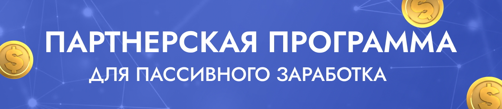

---
layout:
  title:
    visible: true
  description:
    visible: true
  tableOfContents:
    visible: true
  outline:
    visible: true
  pagination:
    visible: true
---

# Пассивный доход по партнёрской программе

<figure><figcaption></figcaption></figure>

Партнерская программа **Watbot** - это программа позволяющая пассивно зарабатывать, не выходя их дома.

**Кому подходит данная партнерская программа** ❓

Партнерская программа подходит всем, кто хочет иметь пассивный стабильный доход, не выходя из дома.

**Что для этого нужно** ❓

Что-бы стать партнером платформы Watbot, вам требуется зарегистрироваться на платформе [Watbot](https://watbot.ru/) перейти в личный кабинет в боковом меню раздел [Партнерская программа](https://watbot.ru/partner), там расположена ваша рефератная ссылка, за привлечение клиентов вы будете получать вознаграждение 20%, за оплаты пользователей сервиса (ежемесячно) Так же вам требуется пройти регистрацию партнера внутри чат-бота, по-кнопке ниже 👇

**Как я или моя компания может зарабатывать на этом деньги** ❓

С вас требуется размещение рекламы на таких платформах как Вконтакте, Одноклассники, Телеграм и подобных, где вы будете рассказывать о том, что вы занимаетесь разработкой чат-ботов для бизнеса и собирать заявки от потенциальных клиентов и передавать их нам

**Какой бюджет нужен для старта** ❓

Размер рекламного бюджета вы назначаете сами, мы можем только дать рекомендацию, бюджета в размере 5000 рублей, вам будет достаточно что-бы получить первого клиента и закрыть его на продажу

**Когда я получу вознаграждение, за приведенного клиента** ❓

Вы получите вознаграждение в виде 20%, после того как наши специалисты возьмут в работу заказ и клиент внесет предоплату, с вами свяжутся наши менеджеры и сообщат вам, что вам доступна выплата и запросят данные для выплаты, средства поступят на ваш счет в течении 3-х рабочих дней, с момента составления заявки на вывод средств, через нашего менеджера

Работаете ли вы физическими лицами ❓

Да, мы работаем с физическими лицами, у которых имеется статус **самозанятого**, для получения выплат.
