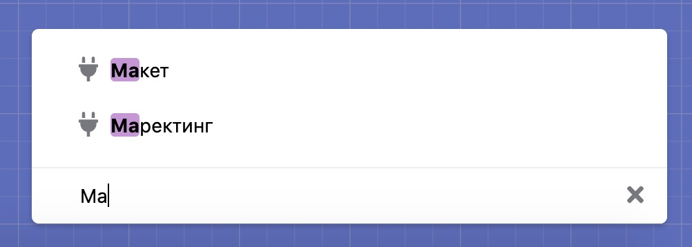

# Дерево сценариев

С ростом бота появляется много сценариев, в которых трудно ориентироваться. Мы решили эту проблему разработав новый инструмент — **«Дерево сценариев»**.

Теперь вы можете создавать вложенные папки и раскладывать по ним ваши сценарии. Просто перенесите курсором мыши нужный сценарий в нужную папку.

У каждого сценария и папки появилось контекстное меню:

.jpg>)

В большой структуре сложно найти текущий сценарий, для этого мы разработали инструмент **«Найти текущий сценарий»**:

Если необходимо развернуть все дерево, воспользуйтесь инструментом **«Развернуть».**

Воспользуйтесь **«Быстрым поиском»** для поиска необходимого сценария:

### Дерево выборки сценария везде

У нас есть отличный инструмент для управления сценариями бота — хранение сценариев в виде дерева с возможностью создавать папки и вкладывать в них сценарии. Но до сих пор в блоке «Сценарий», шаге авторассылки или в подготовленных фразах выбирать сценарий можно было только в виде линейного списка. Теперь это представлено в удобной структуре во всех разделах, где есть выборка сценария:

###

