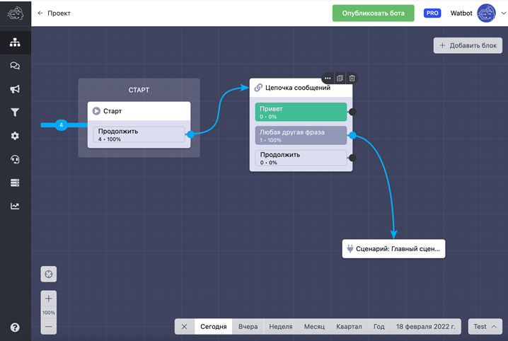

# Конверсии связей в сценариях

Относительно каждого блока вы можете посмотреть сколько было переходов по каждой связи. Для понимания конверсий все отображается в процентах, а если нужно посмотреть точное количество переходов, наведите курсор на связь блока. В стартовом блоке жирной линией показывается сколько было переходов в бота. Аналитика работает в режиме реального времени!

Вы можете просматривать аналитику за различные промежутки времени.

#### Отличных конверсий вашим ботам!
