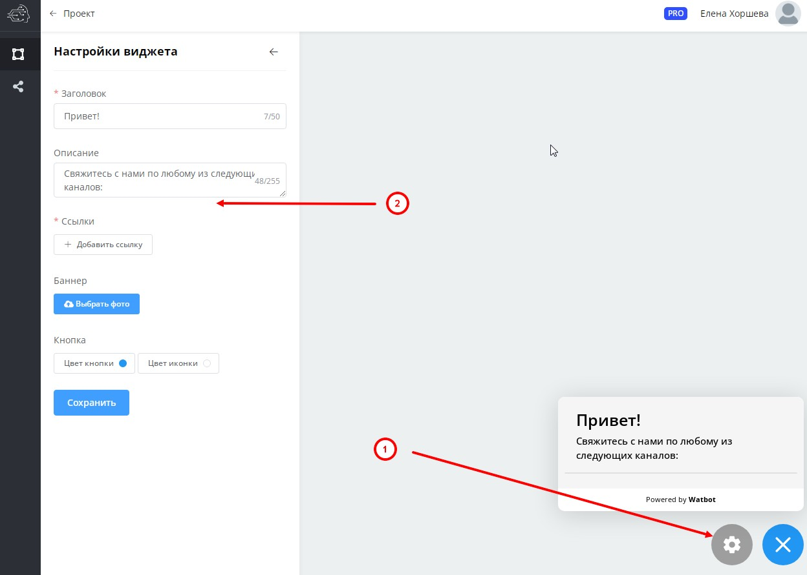
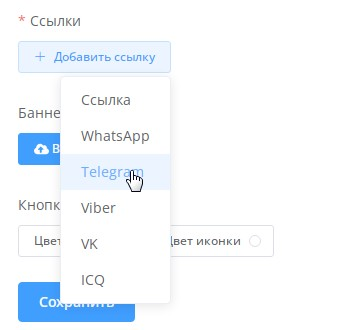
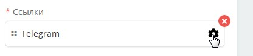
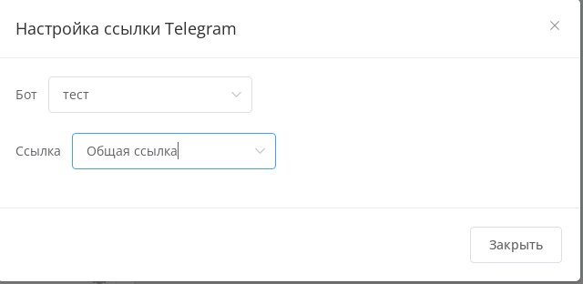
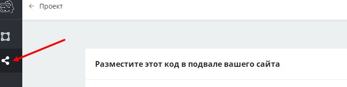
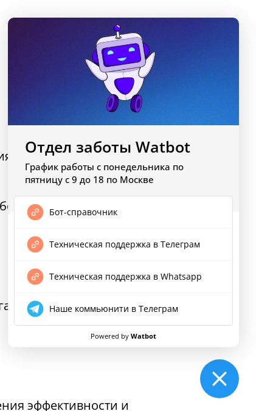

# Виджеты

<figure><figcaption></figcaption></figure>

Кликните на эту кнопку. Далее в нижнем правом углу кликните на иконку шестеренки чтобы открыть панель настроек слева:

<figure><figcaption></figcaption></figure>

Вы можете указать название виджета, описание, добавить баннер, создать ссылки и настроить цвет кнопок. В качестве ссылок можно использовать как сторонние ссылки, так и прямые ссылки на любые сценарии чат-ботов вашего проекта:

<figure><figcaption></figcaption></figure>

<figure><figcaption></figcaption></figure>

<figure><figcaption></figcaption></figure>

После проведения всех настроек нажмите на иконку "поделиться" в левой панели и скопируйте код для размещения в подвале вашего сайта:

<figure><figcaption></figcaption></figure>

Пример виджета можно увидеть на нашем сайте:

<figure><figcaption></figcaption></figure>

Подробнее можно узнать из нашей видео инструкции:


