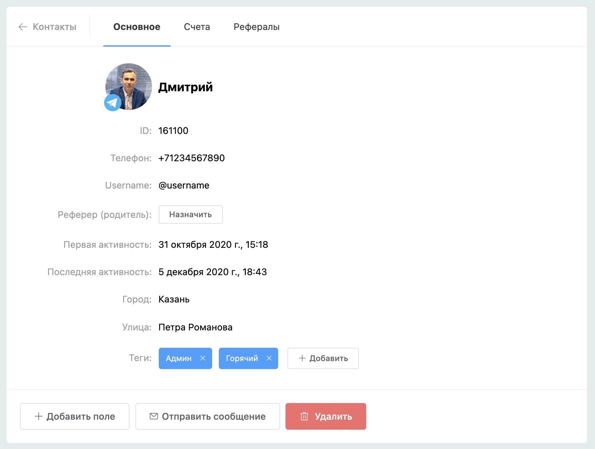
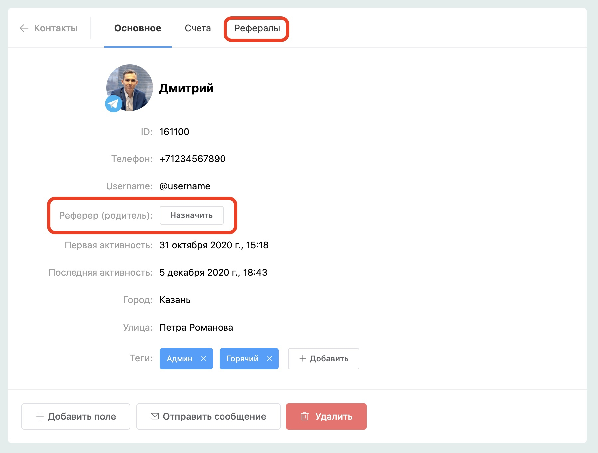

# Карточка контакта

Основная информация контакта, пользовательские переменные и теги объединены в одну карточку. Рефералы и счета переехали в новые вкладки в карточке контакта.

Чтобы добавить новую переменную, нажмите кнопку «Добавить поле».

### Последняя активность контакта

Последняя активность — это новое поле в карточке контакта, которое означает время последнего взаимодействия контакта с ботом.

### Управление реферерами контакта

Если пользователи бота участвуют в реферальной программе, вы можете просматривать рефералы контакта или назначать реферера (родителя).

