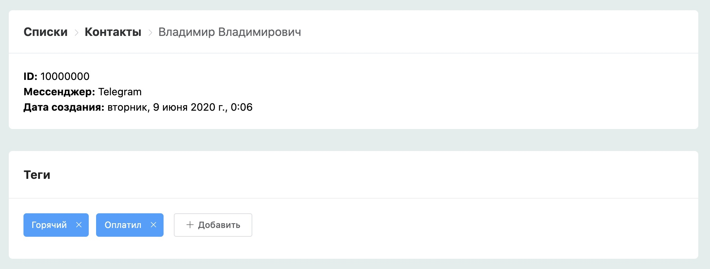

# Управление тегами

1\) Добавили в карточку контакта управление тегами.

2\) На платформе имеется возможность выгружать пользователей имеющих определенный присвоенный тег.

3\) Тэги можно использовать для создания рассылок WhatsApp: это возможно благодаря функции создания групп с помощью тегов.

4\) Обратите внимание, что теги сделки CRM и теги контакта разные. Пользователь появится только тогда, когда попадет на блок с включенной настройкой "отправлять уведомления при попадании в этот блок".  Отправлять заявки на другую доску CRM на данный момент невозможно.

