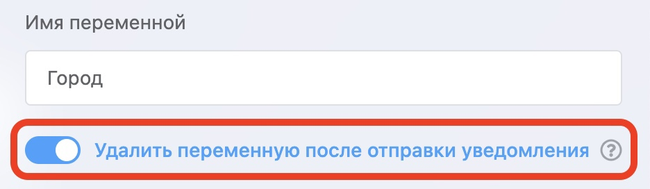

# Выборочное удаление пользовательских переменных после создания заявки

#### Выборочное удаление пользовательских переменных после создания заявки

С этого обновления необходимо отмечать отдельно каждую пользовательскую переменную, которую вы хотите удалить после создания заявки.

