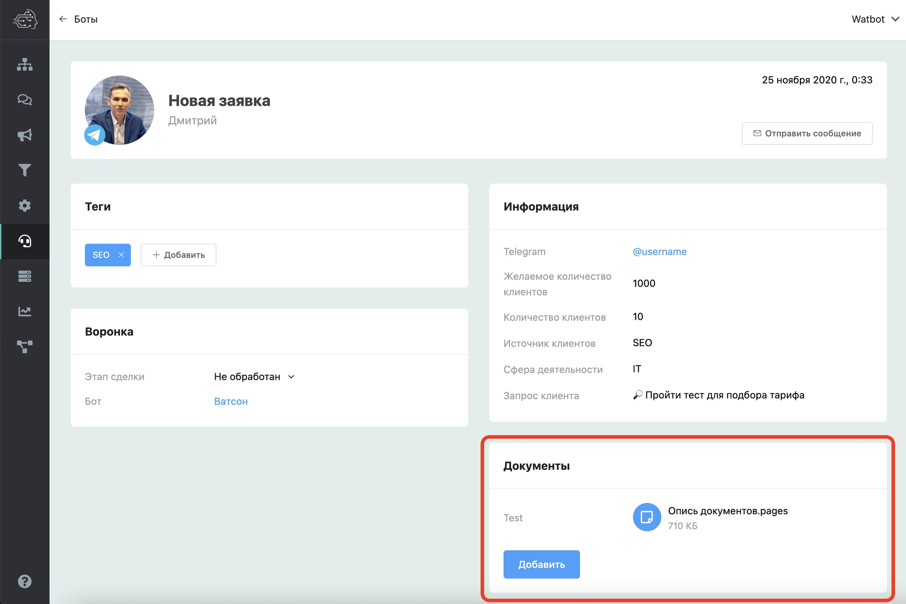
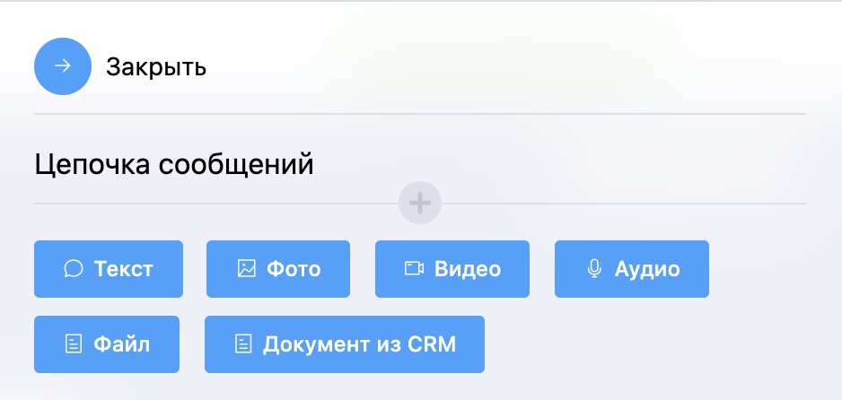
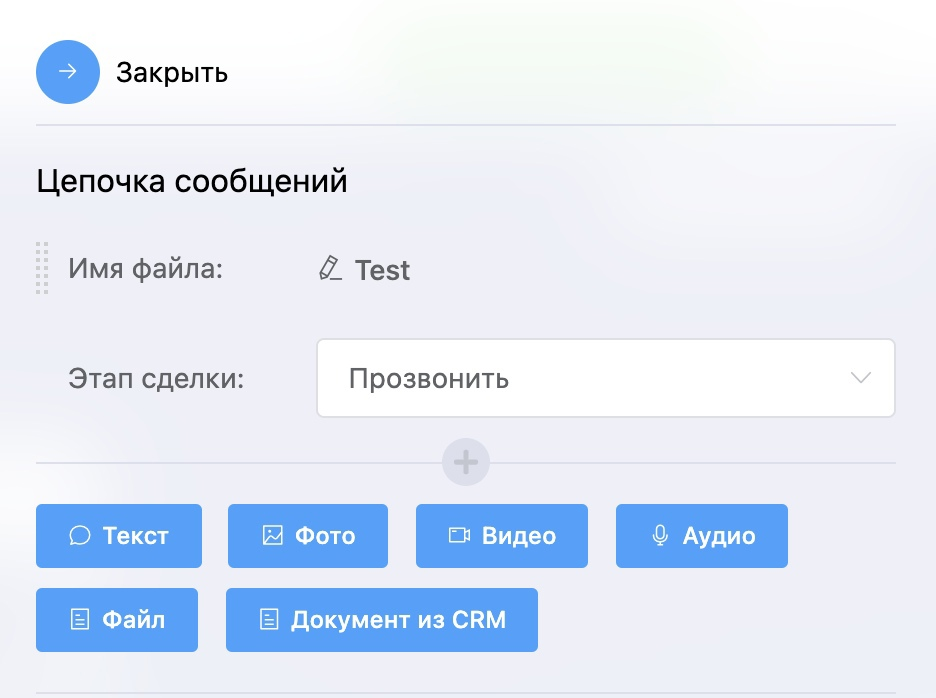

# Документы в карточке сделки встроенной CRM и их рассылка

Вы можете прикреплять различные документы к сделке, а затем сделать рассылку. Для этого в сценарии создайте блок «Цепочка сообщений» и выберите тип «Документ из CRM».

Далее необходимо указать имя файла и этап сделки.

В итоге пользователь получит свой файл из сделки CRM, которая находится на определенном этапе. Если не указывать этап, то файл берется из первой попавшейся сделки, которая имеет файл.
