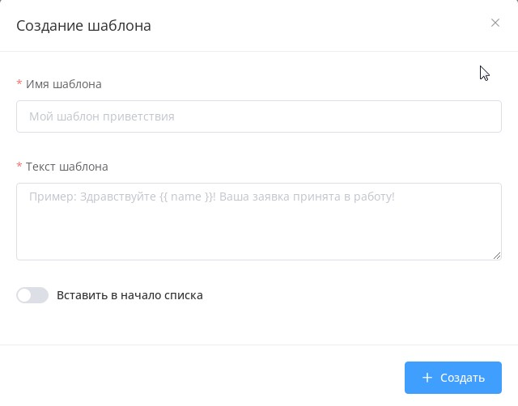

# Встроенный мессенджер (с возможностью менеджеру вмешиваться в диалог с пользователем чат-бота)

1\) справа теперь можно видеть всю информацию о подписчике (переменные, тэги и т.д.). Сразу же можно добавлять новые тэги и пользовательские переменные.

2\) если менеджер вмешивается в диалог есть 2 зоны где это можно увидеть&#x20;

* слева в диалогах будет отображаться значок “пауза”. Т.е. при просмотре списка диалогов сразу можно увидеть этот значок и понять какой диалог сейчас на паузе&#x20;

* если открыть диалог, то можно увидеть уведомление о том, что бот отключён для данного пользователя и время автоматического включения. Время можно настроить нажав на кликабельную ссылку “настроить время” после уведомления.&#x20;

* Также в этом разделе можно отключить бота навсегда. Тогда слева в диалоге пользователя будет значок “стоп” и соответствующее уведомление в карточке контакта. При необходимости включить бота нажимаем соответствующую кнопку и следующее сообщение от клиента будет обрабатывать уже бот.

* диалог больше не открывается автоматически. Это нужно чтобы администратор не помечал сообщения оператора прочитанными

При необходимости можно создавать заранее подготовленные ответы - шаблоны сообщений. Всего можно создать до 3000 шаблонов. Для этого откройте чат с любым пользователем и нажмите на иконку в правом нижнем углу:

<figure><figcaption></figcaption></figure>

Далее кликните на "создать шаблон" и заполните форму:

<figure><figcaption></figcaption></figure>


